# Microservices Demo

Distributed voting application built with Java, Go, Node.js, Kafka, and PostgreSQL.

## Team

- Juan Esteban Ruiz
- Tomas Quintero

## Architecture



Main services and flow:

1. `vote` (Java Spring) receives votes.
2. Votes are published to Kafka topic `votes`.
3. `worker` (Go) consumes events and writes to PostgreSQL.
4. `result` (Node.js + Socket.IO) reads aggregated votes and updates the UI in real time.

## Design Patterns Applied

- Competing Consumers: worker service runs with 3 replicas.
- External Configuration Store: Azure deploy credentials are consumed from GitHub Actions Secrets.

## Deployment Model

- Local/dev workflow: run and iterate quickly from your machine.
- Cloud workflow: deploy to Azure AKS for shared, scalable execution.

AKS target used by pipeline:

- Cluster: `microservices-demo-aks`
- Resource Group: `microservices-demo-rg`
- Registry: `ghcr.io/jruiz1601`

## CI/CD (GitHub Actions)

Workflow file: `.github/workflows/dev.yml`

- `push` on `feature/**` and `main` (filtered by service paths).
- `pull_request` targeting `feature/**` (filtered by service paths).
- `workflow_dispatch` available for manual execution.
- Build and push images:
	- `ghcr.io/jruiz1601/vote:${{ github.sha }}`
	- `ghcr.io/jruiz1601/worker:${{ github.sha }}`
	- `ghcr.io/jruiz1601/result:${{ github.sha }}`
- Deploy job runs on:
	- push to `main`
	- manual `workflow_dispatch`

## Infrastructure as Code (Terraform)

Terraform code lives in `terraform/` and provisions the Azure base platform for the app.

Managed resources:

- Azure Resource Group: `microservices-demo-rg`
- Azure AKS Cluster: `microservices-demo-aks`
- Default node pool size: `2`
- VM size: `Standard_B2s`
- Region: `centralus`

Remote state backend (Azure Storage):

- Resource Group: `tfstate-rg3`
- Storage Account: `tfstatemicrosvcdemo`
- Container: `tfstate`
- State key: `microservices.tfstate`

## Infrastructure Pipeline (Terraform CI/CD)

Workflow file: `.github/workflows/infra.yml`

1. `pull_request` to `main` with changes in `terraform/**` runs:
	`terraform init`, `terraform fmt -check`, `terraform validate`, and `terraform plan`.
2. `push` to `main` with changes in `terraform/**` runs:
	`terraform apply -auto-approve -input=false`.

Both jobs authenticate to Azure using GitHub Secrets (`AZURE_CLIENT_ID`, `AZURE_CLIENT_SECRET`, `AZURE_SUBSCRIPTION_ID`, `AZURE_TENANT_ID`).

## Run with Okteto (dev)

```bash
git clone https://github.com/okteto/microservices-demo
cd microservices-demo
okteto login
okteto deploy
```

Develop per service:

```bash
okteto up result
```

```bash
okteto up vote
```

```bash
okteto up worker
make start
```

## Notes

- Voting app accepts one vote per client (cookie-based voter identity).
- This project is a teaching/demo setup to practice distributed architecture, AKS deployment, and CI/CD.
